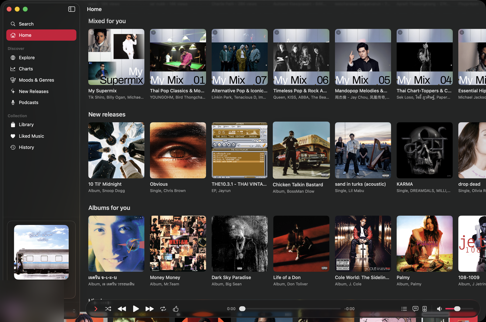

# Boombox

> A native macOS client for YouTube Music. Built in SwiftUI, runs on your Premium subscription, ships zero telemetry.


Based on [Kaset](https://github.com/sozercan/kaset) by [@sozercan](https://github.com/sozercan), stripped down for a personal source-build use case. See [Attribution](#attribution).



## Pre-release notice

Boombox is a personal source-build project in pre-release. There are no signed binaries, no App Store distribution, and no auto-updater. Clone the repo and build it yourself. Expect rough edges — report them in Issues.

## Features

- **Native macOS, SwiftUI.** Liquid Glass player bar, sidebar navigation, Focus and Small Player presentation modes.
- **YouTube Music Premium playback.** DRM-protected playback stays inside a hidden `WKWebView` using your existing subscription.
- **System integration.** Now Playing in Control Center, media keys, Dock right-click menu, haptics, optional track notifications.
- **Library.** Browse playlists, liked songs, artists, albums, and subscribed podcasts.
- **Search.** Songs, albums, artists, playlists, podcasts.
- **Lyrics.** Plain YouTube Music lyrics and synced [LRCLib](https://lrclib.net) lyrics with line-by-line highlighting.
- **Queue management.** View, reorder, shuffle, and clear the playback queue.
- **Share sheet.** Share songs, playlists, albums, and artists through the native macOS share sheet.
- **Command palette.** `⌘L` opens the command palette; `⌘Y` toggles lyrics.
- **Audio-only playback** and a CoreAudio output picker with AirPods detection.

## Requirements

- macOS 26.0 or newer (Liquid Glass APIs)
- Swift 6.2+ toolchain — Xcode 26+ or a swift.org toolchain
- A YouTube Music Premium subscription (required for DRM playback)
- Optional: a local Apple Development certificate for signing — the build falls back to ad-hoc signing if none is present

## Build from source

```bash
git clone <this-repo-url>
cd <repo>
swift build
swift test --skip KasetUITests
Scripts/build-app.sh release
open .build/app/Boombox.app
```

The resulting bundle is `.build/app/Boombox.app` with bundle id `com.melboonchan.boombox`. Signing uses a local Apple Development certificate when one is available and falls back to ad-hoc signing.

To install it in Applications:

```bash
cp -R .build/app/Boombox.app /Applications/
open /Applications/Boombox.app
```

## Signing in

Boombox plays through YouTube Music using your own Premium subscription. Google passkeys usually do not work inside an embedded login WebView, so the recommended first-run flow is Safari sign-in:

1. Open Boombox and choose **Sign in with Google**.
2. In the login sheet, choose **Use Safari sign-in**.
3. Click **Open YouTube Music in Safari**.
4. Sign in to `music.youtube.com` in Safari and complete any passkey, 2FA, or account prompts there.
5. Copy your own Safari YouTube/Google auth cookie rows, or a `Cookie:` header from your own Safari session, into the **Safari cookie rows or Cookie header** box in Boombox. Safari Web Inspector or a trusted local cookie-export tool can provide this; Boombox accepts Netscape-style cookie rows, `Cookie:` headers, or `name=value` pairs separated by semicolons.
6. Click **Import Cookies**.

Boombox imports only allowlisted YouTube/Google auth cookies, requires `SAPISID` or `__Secure-3PAPISID`, stores them locally in the app's WebKit data store and macOS Keychain, then clears the paste box. Cookie values are never logged, exported, or sent anywhere by Boombox. Treat cookie values like passwords: do not paste them into issues, logs, chat, or third-party tools you do not trust.

Embedded sign-in is still available from the same sheet and may work for password-based Google sign-in. Safari sign-in is there so passkey users can authenticate in Safari instead of typing their Google password into the app.

## Using Boombox

- **Home** shows personalized YouTube Music recommendations.
- **Explore** opens charts, new releases, moods, and genres.
- **Library** loads your playlists, liked songs, artists, albums, and podcasts.
- **Search** finds songs, albums, artists, playlists, and podcasts.
- **Command Bar** (`⌘L`) is the fast path: type a query, run a search, or use quick actions.
- **Player bar** controls playback, shuffle, repeat, likes/dislikes, queue, lyrics, AirPlay, and output volume.
- **Queue** can be opened as a popup or side panel. The side panel supports reorder, remove, undo, redo, shuffle, and clear.
- **Lyrics** shows YouTube Music plain lyrics and optional synced LRCLib lyrics.
- **Focus Player** and **Small Player** switch the window into now-playing layouts while music continues.
- **Media keys**, Control Center Now Playing, and the Dock right-click menu work with playback.

## Keyboard shortcuts

| Shortcut | Action |
| -------- | ------ |
| `Space` | Play / Pause |
| `⌘→` | Next track |
| `⌘←` | Previous track |
| `⌘↑` | Volume up |
| `⌘↓` | Volume down |
| `⌘S` | Toggle shuffle |
| `⌘R` | Cycle repeat mode: Off, All, One |
| `⌘Y` | Toggle lyrics |
| `⇧⌘F` | Toggle Focus Player |
| `⇧⌘M` | Toggle Small Player |
| `⌘1` | Go to Home |
| `⌘2` | Go to Explore |
| `⌘3` | Go to Library |
| `⌘F` | Go to Search |
| `⌘L` | Open Command Bar |
| `⌘0` | Show the main Boombox window |

Mute is available from the Playback menu. It intentionally has no default shortcut so macOS can keep `⌘M` for Minimize. Full reference: [docs/keyboard-shortcuts.md](docs/keyboard-shortcuts.md).

## What's different from upstream Kaset

Boombox removes distribution, AI, and extension infrastructure that isn't needed for a personal source build. Full list in [STRIPPED.md](STRIPPED.md). Highlights:

- **Removed:** Apple FoundationModels integration, Last.fm scrobbling, Sparkle auto-updater, AppleScript support, `kaset://` URL scheme, WKWebExtension runtime, API explorer CLI.
- **Kept:** native player UI, YouTube Music Premium playback, system media integration, LRCLib synced lyrics, library/search/queue/share.

Security and trust boundary notes live in [AUDIT.md](AUDIT.md).

## Architecture and docs

- [docs/architecture.md](docs/architecture.md) — component overview
- [docs/playback.md](docs/playback.md) — playback subsystem
- [docs/keyboard-shortcuts.md](docs/keyboard-shortcuts.md) — keybindings
- [docs/testing.md](docs/testing.md) — test strategy
- [docs/adr/](docs/adr/) — architecture decision records

## Contributing

Issues are open — bug reports and feature requests are welcome. PRs are reviewed case-by-case: because this is a personal fork, not every contribution will be merged, but thoughtful patches get read. For anything larger than a small fix, open an issue to discuss first.

## Known limitations

- No binary distribution — source build only
- Google passkeys unsupported inside the embedded login WebView (use Safari cookie import)
- macOS 26+ only (uses Liquid Glass APIs)
- Swift module is still named `Kaset` internally — preserved as natural upstream attribution

## Attribution

Boombox is a fork of [Kaset](https://github.com/sozercan/kaset) by [@sozercan](https://github.com/sozercan), forked at commit [`700b72d`](https://github.com/sozercan/kaset/commit/700b72d49e47d55d6f1b2fde6c5a73f70228843c). Without the original implementation this project would not exist — huge thanks.

## License

MIT — see [LICENSE](LICENSE). Original copyright © 2025 sozercan is preserved as required by the MIT terms. Fork-specific additions are also MIT.

## Disclaimer

Boombox is an unofficial personal application and is not affiliated with YouTube, YouTube Music, or Google. YouTube, YouTube Music, and related marks belong to Google LLC.
